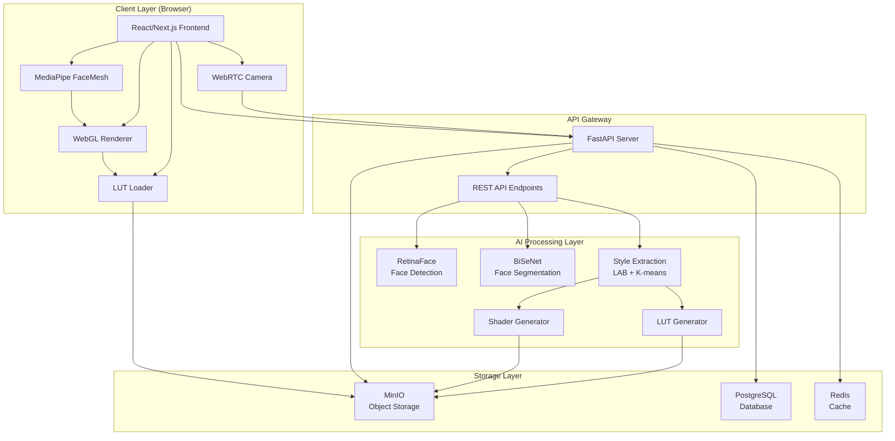
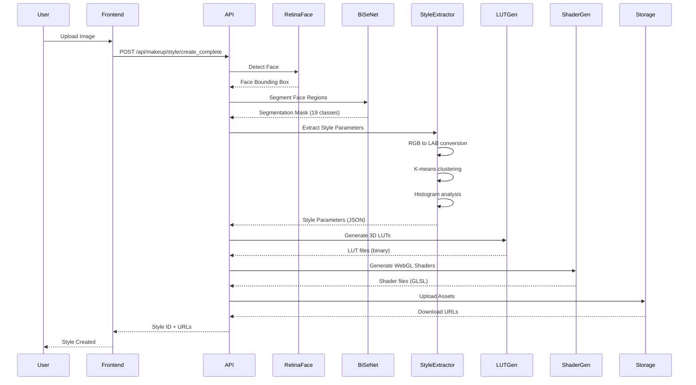
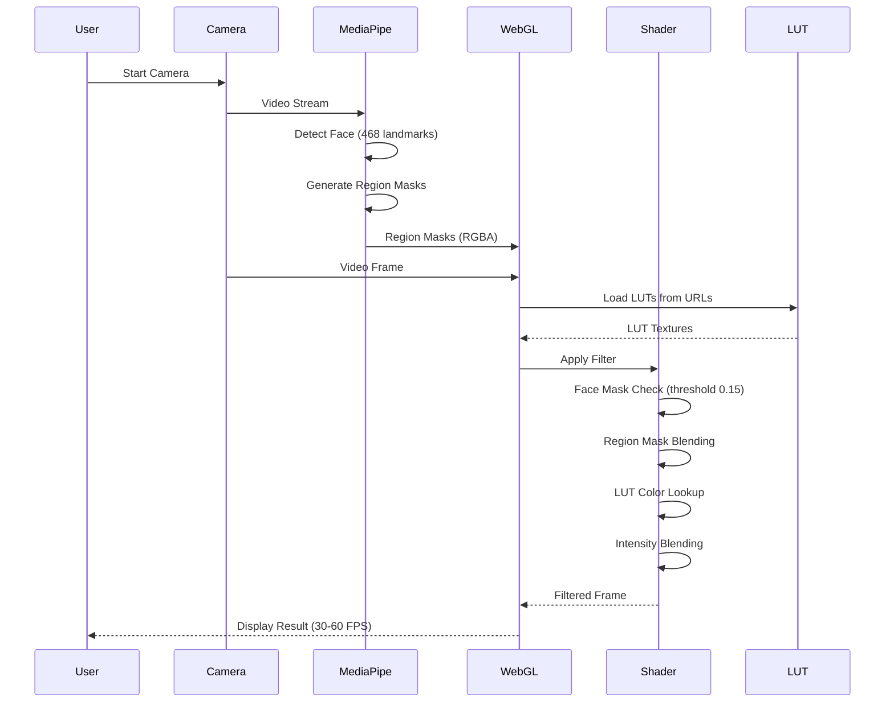
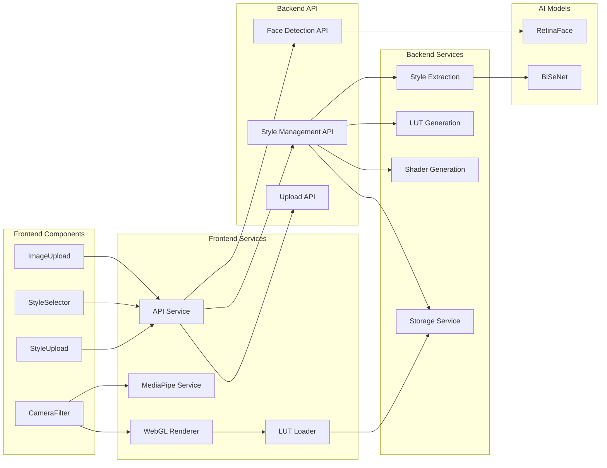
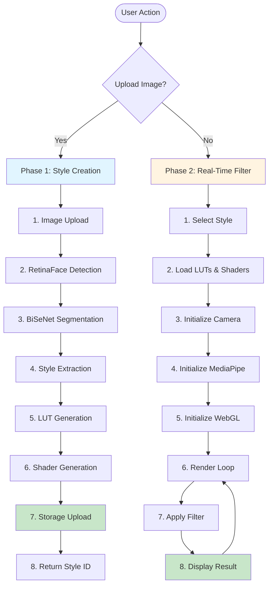
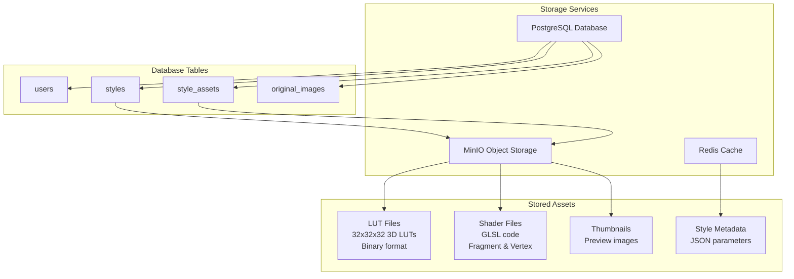
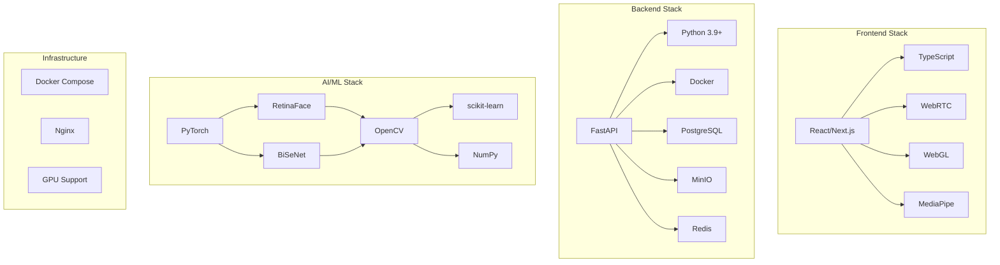
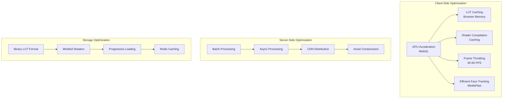
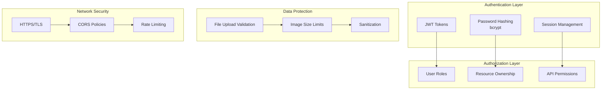

# Facetory - Architecture Diagram

## System Architecture Overview

### High-Level Architecture

## Detailed Component Architecture

### Phase 1: Style Creation Pipeline

### Phase 2: Real-Time Filter Application

## Component Interaction Diagram

## Data Flow Architecture

## Storage Architecture

## Technology Stack Diagram

## Performance Optimization Architecture

## Security Architecture

