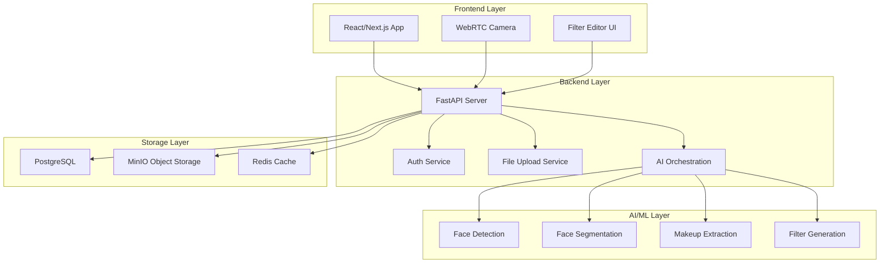

# Thiết kế hệ thống - Facetory

## 🏗️ Kiến trúc tổng thể



## 📊 Database Schema

### Users Table
```sql
CREATE TABLE users (
    id UUID PRIMARY KEY DEFAULT gen_random_uuid(),
    email VARCHAR(255) UNIQUE NOT NULL,
    password_hash VARCHAR(255) NOT NULL,
    username VARCHAR(100) UNIQUE,
    created_at TIMESTAMP DEFAULT NOW(),
    updated_at TIMESTAMP DEFAULT NOW()
);
```

### Original Images Table
```sql
CREATE TABLE original_images (
    id UUID PRIMARY KEY DEFAULT gen_random_uuid(),
    user_id UUID REFERENCES users(id),
    filename VARCHAR(255) NOT NULL,
    minio_path VARCHAR(500) NOT NULL,
    face_count INTEGER DEFAULT 1,
    image_size INTEGER,
    created_at TIMESTAMP DEFAULT NOW()
);
```

### Makeup Extractions Table
```sql
CREATE TABLE makeup_extractions (
    id UUID PRIMARY KEY DEFAULT gen_random_uuid(),
    original_image_id UUID REFERENCES original_images(id),
    lip_color VARCHAR(7),
    eye_shadow_color VARCHAR(7),
    blush_color VARCHAR(7),
    brow_shape VARCHAR(50),
    makeup_attributes JSONB,
    landmarks JSONB,
    created_at TIMESTAMP DEFAULT NOW()
);
```

### Filters Table
```sql
CREATE TABLE filters (
    id UUID PRIMARY KEY DEFAULT gen_random_uuid(),
    user_id UUID REFERENCES users(id),
    makeup_extraction_id UUID REFERENCES makeup_extractions(id),
    filter_name VARCHAR(100),
    filter_data JSONB,
    minio_path VARCHAR(500),
    is_public BOOLEAN DEFAULT FALSE,
    created_at TIMESTAMP DEFAULT NOW(),
    updated_at TIMESTAMP DEFAULT NOW()
);
```

### Captured Photos Table
```sql
CREATE TABLE captured_photos (
    id UUID PRIMARY KEY DEFAULT gen_random_uuid(),
    user_id UUID REFERENCES users(id),
    filter_id UUID REFERENCES filters(id),
    filename VARCHAR(255) NOT NULL,
    minio_path VARCHAR(500) NOT NULL,
    created_at TIMESTAMP DEFAULT NOW()
);
```

## 🔄 API Design

### Authentication APIs
```python
# Auth endpoints
POST /api/auth/register
POST /api/auth/login
POST /api/auth/logout
GET /api/auth/me
POST /api/auth/refresh-token
```

### Core Feature APIs
```python
# Upload & Face Detection
POST /api/upload/image
POST /api/upload/crop-face
GET /api/upload/status/{task_id}

# Makeup Extraction
POST /api/extract/makeup
GET /api/extract/makeup/{extraction_id}

# Filter Management
POST /api/filter/generate
GET /api/filter/{filter_id}
PUT /api/filter/{filter_id}
DELETE /api/filter/{filter_id}
GET /api/user/filters

# Photo Capture
POST /api/capture/photo
GET /api/capture/download/{photo_id}
GET /api/user/photos
```

## 🗂️ Storage Strategy

### MinIO Bucket Structure
```
facetory-storage/
├── original-images/
│   ├── user_{user_id}/
│   │   ├── {timestamp}_{uuid}.jpg
│   │   └── ...
│   └── guest/
│       ├── temp_{timestamp}_{uuid}.jpg
│       └── ...
├── cropped-faces/
│   ├── user_{user_id}/
│   └── guest/
├── filters/
│   ├── user_{user_id}/
│   └── public/
├── captured-photos/
│   └── user_{user_id}/
└── temp/
    └── processing/
```

### File Naming Convention
- **Original Images**: `{user_id}_{timestamp}_{uuid}.{ext}`
- **Cropped Faces**: `{user_id}_{timestamp}_{uuid}_cropped.{ext}`
- **Filters**: `{user_id}_{timestamp}_{uuid}_filter.{ext}`
- **Captured Photos**: `{user_id}_{timestamp}_{uuid}_captured.{ext}`

## 🔐 Security Design

### Authentication Flow
1. User đăng ký/đăng nhập
2. Server tạo JWT token + refresh token
3. Client lưu tokens trong secure storage
4. API calls include JWT token trong header
5. Server validate token và trả về user info

### Authorization Levels
- **Guest**: Upload, extract, preview, download (không lưu)
- **User**: Tất cả chức năng + lưu trữ dữ liệu
- **Admin**: Quản lý hệ thống, xem logs

### Data Protection
- Mã hóa mật khẩu với bcrypt
- JWT tokens có expiration time
- Rate limiting cho API calls
- File upload validation
- CORS configuration

## ⚡ Performance Optimization

### Caching Strategy
- **Redis Cache**: User sessions, API responses
- **CDN**: Static assets, public filters
- **Browser Cache**: JavaScript, CSS, images

### Database Optimization
- Indexes trên các columns thường query
- Connection pooling
- Query optimization
- Pagination cho large datasets

### AI/ML Optimization
- Model caching
- Batch processing
- Async processing cho heavy tasks
- GPU acceleration (nếu có)

## 🔄 Data Flow

### Upload & Face Detection Flow
```
User Upload → Backend → Face Detection → Crop UI → Backend → Storage
```

### Makeup Extraction Flow
```
Cropped Image → Segmentation → Landmark Detection → Color Extraction → JSON Response
```

### Filter Generation Flow
```
Makeup Data → BeautyGAN → Filter File → Storage → Frontend Preview
```

### Real-time Application Flow
```
Camera Stream → Face Detection (Web) → Filter Overlay → Canvas Output
```

## 🚀 Deployment Architecture

### Development Environment
```yaml
# docker-compose.yml
services:
  frontend: React dev server
  backend: FastAPI dev server
  postgres: Database
  minio: Object storage
  redis: Cache
```

### Production Environment
```yaml
# docker-compose.prod.yml
services:
  nginx: Reverse proxy
  frontend: React build
  backend: FastAPI with workers
  postgres: Database with backup
  minio: Object storage with replication
  redis: Cache cluster
  ai-service: AI/ML models
```

## 📈 Scalability Considerations

### Horizontal Scaling
- Load balancer cho multiple backend instances
- Database read replicas
- Redis cluster
- MinIO distributed storage

### Vertical Scaling
- GPU instances cho AI/ML services
- High-memory instances cho database
- CDN cho static content

### Monitoring & Logging
- Application metrics (response time, error rate)
- System metrics (CPU, memory, disk)
- AI model performance metrics
- User behavior analytics 