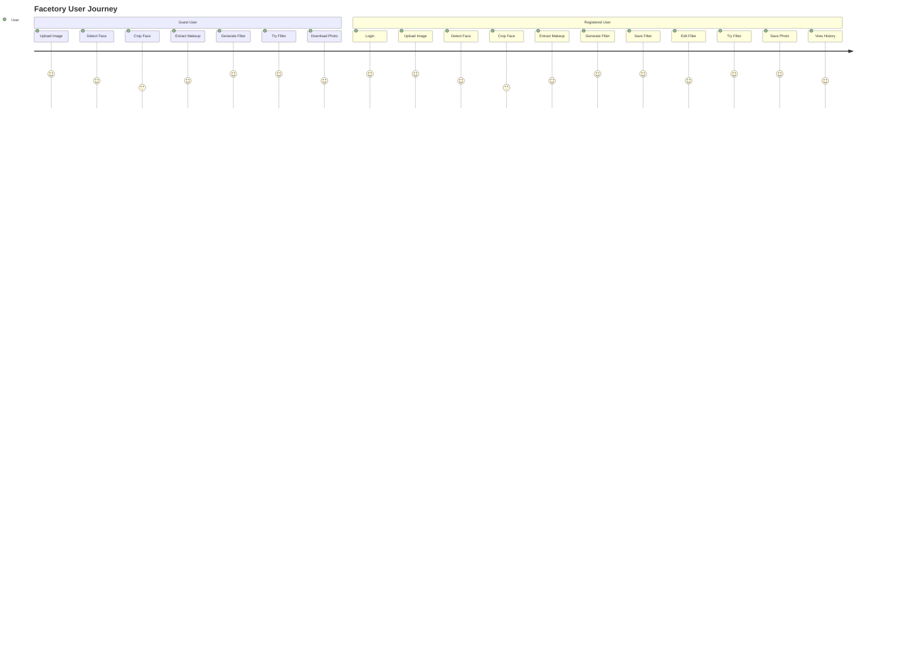

# User Flow - Facetory

## 🎯 Tổng quan User Journey



## 🔄 Chi tiết User Flow

### **Flow 1: Guest User - Tạo và dùng thử filter**

#### Bước 1: Truy cập website
- **Action**: User truy cập `facetory.com`
- **UI**: Landing page với demo và nút "Try Now"
- **Result**: User thấy giao diện chính

#### Bước 2: Upload ảnh
- **Action**: User click "Upload Image" hoặc drag & drop ảnh
- **UI**: File picker hoặc drop zone
- **Validation**: Kiểm tra file type (JPG, PNG), size (< 10MB)
- **Result**: Ảnh được upload và hiển thị preview

#### Bước 3: Phát hiện khuôn mặt
- **Action**: Hệ thống tự động detect face
- **UI**: Loading spinner + "Detecting faces..."
- **Logic**: 
  - Nếu 1 khuôn mặt → Chuyển sang bước 4
  - Nếu >1 khuôn mặt → Hiển thị crop tool
- **Result**: Hiển thị số lượng khuôn mặt phát hiện được

#### Bước 4: Crop khuôn mặt (nếu cần)
- **Action**: User chọn/crop 1 khuôn mặt (nếu có nhiều)
- **UI**: Crop tool với bounding box, preview real-time
- **Result**: Ảnh đã crop với 1 khuôn mặt

#### Bước 5: Trích xuất makeup
- **Action**: Hệ thống trích xuất lớp trang điểm
- **UI**: Loading + "Extracting makeup..."
- **Logic**: AI phân vùng và trích xuất màu sắc
- **Result**: Hiển thị kết quả với overlay các vùng

#### Bước 6: Tạo filter
- **Action**: Hệ thống tạo filter từ makeup data
- **UI**: Loading + "Generating filter..."
- **Result**: Filter được tạo và hiển thị preview

#### Bước 7: Dùng thử filter
- **Action**: User click "Try Filter" để bật camera
- **UI**: Camera permission request
- **Logic**: Áp dụng filter real-time
- **Result**: Filter hiển thị trên camera

#### Bước 8: Chụp ảnh
- **Action**: User chụp ảnh với filter
- **UI**: Camera view với filter + nút "Capture"
- **Result**: Ảnh được chụp và hiển thị

#### Bước 9: Download ảnh
- **Action**: User download ảnh đã chụp
- **UI**: Preview ảnh + nút "Download"
- **Result**: Ảnh được download về máy

---

### **Flow 2: Registered User - Lưu trữ và quản lý**

#### Bước 1: Đăng ký/Đăng nhập
- **Action**: User đăng ký tài khoản mới hoặc đăng nhập
- **UI**: Form đăng ký/đăng nhập
- **Validation**: Email format, password strength
- **Result**: User được authenticate

#### Bước 2-6: Tương tự Guest User
- Upload ảnh → Detect face → Crop → Extract makeup → Generate filter

#### Bước 7: Lưu filter
- **Action**: User đặt tên và lưu filter
- **UI**: Dialog nhập tên filter + nút "Save"
- **Logic**: Lưu filter vào database
- **Result**: Filter được lưu với tên

#### Bước 8: Chỉnh sửa filter (tùy chọn)
- **Action**: User chỉnh sửa màu sắc, độ đậm nhạt
- **UI**: Color picker, sliders cho từng vùng
- **Logic**: Cập nhật filter parameters
- **Result**: Filter được cập nhật

#### Bước 9: Dùng thử và lưu ảnh
- **Action**: User thử filter và chụp ảnh
- **UI**: Camera với filter + capture button
- **Logic**: Lưu ảnh vào user's gallery
- **Result**: Ảnh được lưu trong user's account

#### Bước 10: Xem lịch sử
- **Action**: User xem dashboard với filters và ảnh đã tạo
- **UI**: Gallery view với filters và photos
- **Logic**: Load user's data từ database
- **Result**: Hiển thị tất cả filters và ảnh

---

## 🎨 UI/UX Flow Details

### **Landing Page**
```
Header (Logo, Login/Register) 
    ↓
Hero Section (Demo video, CTA)
    ↓
Features Section
    ↓
Footer
```

### **Main Application Flow**
```
Sidebar Navigation
    ↓
Upload Area
    ↓
Processing Steps (Face Detection → Makeup Extraction → Filter Generation)
    ↓
Filter Preview & Editor
    ↓
Camera Try-on
    ↓
Photo Capture & Download
```

### **User Dashboard (Registered)**
```
Header (User info, Logout)
    ↓
Sidebar (My Filters, My Photos, Settings)
    ↓
Main Content (Gallery view)
    ↓
Filter/Photo Management
```

## 🔄 Error Handling Flows

### **Upload Errors**
- **File too large**: Hiển thị error message + max size info
- **Invalid file type**: Hiển thị supported formats
- **Upload failed**: Retry button + error details

### **Face Detection Errors**
- **No face detected**: Suggest upload different image
- **Multiple faces**: Show crop tool
- **Detection failed**: Retry button

### **AI Processing Errors**
- **Extraction failed**: Retry with different image
- **Filter generation failed**: Show error + retry option
- **Timeout**: Show progress + retry option

### **Camera Errors**
- **Permission denied**: Show instructions to enable camera
- **Camera not available**: Show alternative options
- **Filter not working**: Debug info + retry

## 📱 Responsive Design Flow

### **Desktop (>1024px)**
- Full sidebar navigation
- Large preview areas
- Multiple columns layout
- Hover effects

### **Tablet (768px-1024px)**
- Collapsible sidebar
- Medium preview areas
- Single column layout
- Touch-friendly buttons

### **Mobile (<768px)**
- Bottom navigation
- Small preview areas
- Stacked layout
- Swipe gestures

## 🎯 Conversion Optimization

### **Guest to Registered User**
- **Trigger**: After successful filter creation
- **CTA**: "Save your filter - Create free account"
- **Benefit**: "Never lose your filters again"

### **Free to Premium (future)**
- **Trigger**: After using basic features
- **CTA**: "Unlock advanced filters"
- **Benefit**: "Access to premium AI models"

## 📊 Analytics Tracking Points

### **User Engagement**
- Time spent on each step
- Drop-off points
- Feature usage frequency
- Filter creation success rate

### **Performance Metrics**
- Upload success rate
- Face detection accuracy
- AI processing time
- Camera permission rate

### **Business Metrics**
- User registration rate
- Filter save rate
- Photo capture rate
- Return user rate 